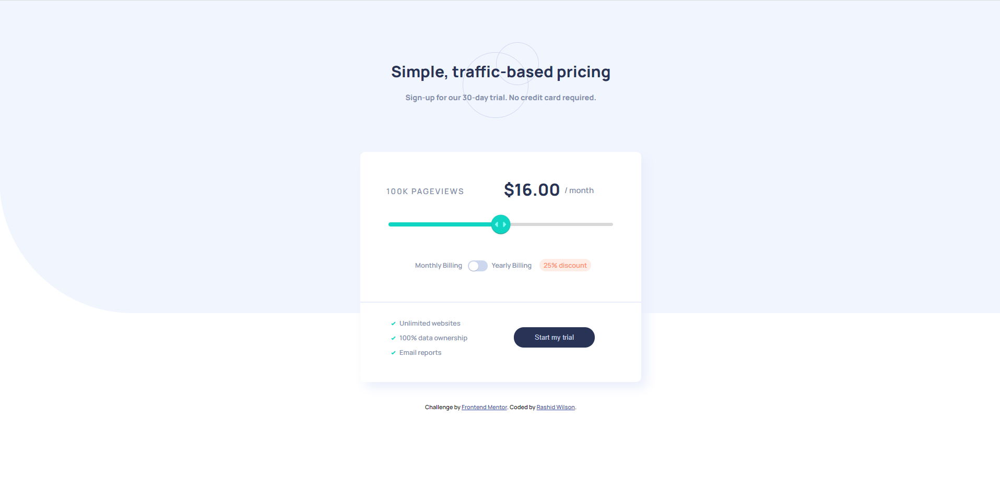

# Frontend Mentor - Interactive pricing component solution

This is a solution to the [Interactive pricing component challenge on Frontend Mentor](https://www.frontendmentor.io/challenges/interactive-pricing-component-t0m8PIyY8). Frontend Mentor challenges help you improve your coding skills by building realistic projects. 

## Table of contents

- [Overview](#overview)
  - [The challenge](#the-challenge)
  - [Screenshot](#screenshot)
  - [Links](#links)
- [My process](#my-process)
  - [Built with](#built-with)
  - [What I learned](#what-i-learned)
  - [Continued development](#continued-development)
  - [Useful resources](#useful-resources)
- [Author](#author)
- [Acknowledgments](#acknowledgments)

## Overview

### The challenge

Users should be able to:

- View the optimal layout for the app depending on their device's screen size
- See hover states for all interactive elements on the page
- Use the slider and toggle to see prices for different page view numbers

### Screenshot



### Links

- Solution URL: [Github Repo](https://github.com/shangum/Interactive-pricing-component-challenge-hub-FrontendMentor)
- Live Site URL: [Hosted By Github Pages](https://shangum.github.io/Interactive-pricing-component-challenge-hub-FrontendMentor/)

## My process

### Built with

- Semantic HTML5 markup
- Sass
- CSS custom properties
- CSS Grid
- Mobile-first workflow
- [React](https://reactjs.org/) - JS library
- [MUI](https://mui.com/) - For React Components (Slider and Switch)

### What I learned

During this project I learned how to take design specifications and build them using React. I started with a straightforward design in order to focus primarily on how to structure the project as well as breaking the design down into simple functional components (two in this case).

I also was able to practice using a React UI library as well as learn how to apply custom styling to its components. Initially I tried making and styling the slider and switch components from scratch. I was able to create the switch component close to design specs but began running into some issues with the slider. Ultimately I settled on using the MUI components as I found it would be a good React exercise.

During my initial custom slider experimentation I began to explore CSS Pseudo Classes. Here is an example rule I used to show the minus sign in the discount span on smaller screens:

```css
.discount::before 
    {
        content: '-';
    }
```

### Continued development

I want to continue to become more familiar with implementing designs using the React Framework.

### Useful resources

- [Create Toggle Switch](https://www.w3schools.com/howto/howto_css_switch.asp) - This page guided me through the designing of a custom switcher. I ended up using the MUI switcher for the final design but this was still a good primer.
- [Style Input Range Slider](https://css-tricks.com/styling-cross-browser-compatible-range-inputs-css/) - This page guided me through the designing of a custom range slider. Again, I ended up using the MUI slider for the final design.
- [Style List Bullets](https://web.dev/css-marker-pseudo-element/) - Helped me style my unordered list bullets.
- [Style List Bullets 2](https://love2dev.com/blog/customize-bulleted-list/) - Another resource that helped me style my unordered list bullets.
- [Cool Color Tool](https://www.w3schools.com/colors/colors_picker.asp) - Helped me get a darker cyan variant based on the one provided in the style guide.
- [CSS Pseudo Classes](https://developer.mozilla.org/en-US/docs/Web/CSS/Pseudo-classes) - Nice pseudo class reference. This aided me in finding the correct pseudo class to implement in order to change the slider's thumb color while it is being dragged.

## Author

- Website - [Rashid Wilson](#)
- Frontend Mentor - [@shangum](https://www.frontendmentor.io/profile/shangum)

## Acknowledgments

Thanks to [@Bonrey](https://www.frontendmentor.io/profile/Bonrey). His "Base Apparel coming soon" page [React solution](https://www.frontendmentor.io/solutions/my-first-react-js-project-3DqxqMwXS) helped guide me through my first Frontend Mentor React solution. Hats off to him!

